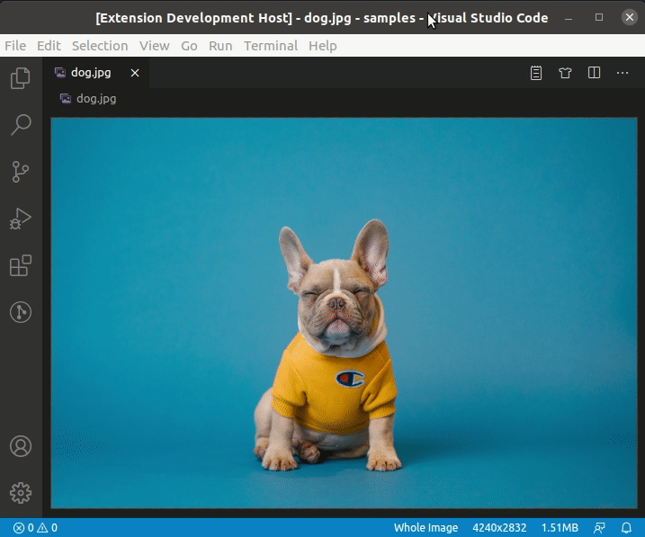
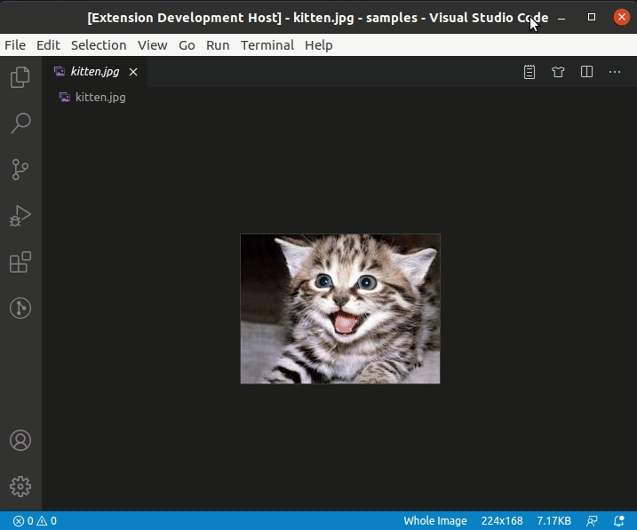
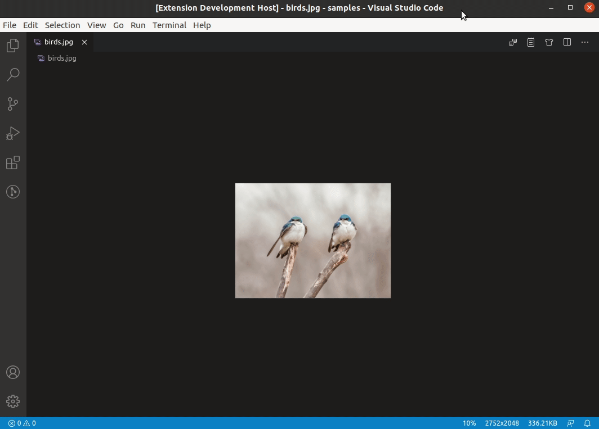

# Editor services on VS Code with Quarkus and DJL

Putting together [VS Code extension](https://code.visualstudio.com/api), [Quarkus](https://quarkus.io/), and [Deep Java Library](https://djl.ai/) into a simple project. Just for fun! :P

## Modules

1. `vscode-extension`: Activate the VS Code extension by initializing the Quarkus app (with support of the backend library from [Kogito Tooling](https://github.com/kiegroup/kogito-tooling)).

1. `app-server`: Quarkus application that exposes REST endpoints for editor services.

**Note**: The Quarkus application is automatically started up and stopped when the VS Code extension is activated and deactivated, respectively. Also, the build process takes care of embedding the Quarkus application into the VS Code extension.

## Requirements

- Node `16+`
- Yarn `1.22.10` (`npm install -g yarn@1.22.10`)
- Lerna `4.0.0` (`npm install -g lerna@4.0.0`)
- Maven `3.6+`
- Java `11`

## Available services

- **Image classification**

  

- **Object detection**

  

- **Auto crop detected objects**

  

- **Sentiment analysis**

  

## Running for development

- Open this example in VS Code 1.43+
- In the terminal, execute `yarn bootstrap && yarn build:dev`
- `F5` to start debugging

Then:

1. Open an image file (`*.png`, `*.jpg`, or `*.jpeg`) and click on the buttons for image services.
1. Open a text file (`*.txt`) and click on the buttons for text services.

VS Code will send a POST request to the embedded Quarkus app, which will perform the required operation on the image/text and report back the result.

**Important**: Running for the first time will require a longer time to complete each operation since the models need to be downloaded and cached into your machine.

## Generating the vsix file

Run `yarn bootstrap && yarn build:prod` if you want to generate the `vsix` file.

Once the build process is done, the `vsix` file will be at `packages/vscode-extension/dist`.

The `vsix` file is also generated by the GitHub workflow and uploaded as an artifact.
