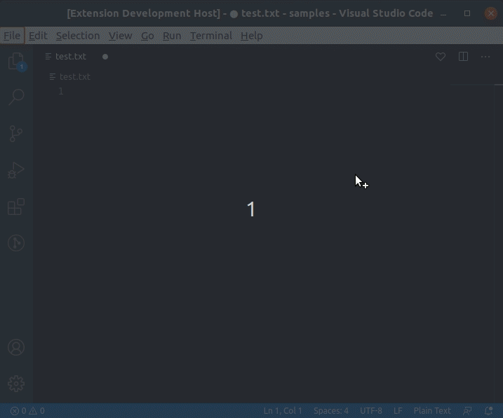

# Editor services on VS Code with Quarkus and DJL

  
  
  

Putting together [VS Code extension](https://code.visualstudio.com/api), [Quarkus](https://quarkus.io/), and [Deep Java Library](https://djl.ai/) into a simple project. Just for fun. :P

## Modules

1. `vscode-extension`: Activate the VS Code extension when an image or text file is opened by initializing the Quarkus app (with support of the backend library from [Kogito Tooling](https://github.com/kiegroup/kogito-tooling)).

1. `app-server`: Quarkus application that exposes REST endpoints for editor services, such as image classification, object detection, and sentiment analysis.

**Note**: The Quarkus application is automatically started up and stopped when the VS Code extension is activated and deactivated, respectively. Also, the build process takes care of embedding the Quarkus application into the VS Code extension.

## Requirements

- [Maven](https://maven.apache.org/) 3.6.2 or later
- [Java](https://openjdk.java.net/install/) 11 or later
- [Node](https://nodejs.org/) LTS
- [Yarn](https://yarnpkg.com/)

## Running the example

- Open this example in VS Code 1.43+
- In the terminal, execute `yarn run init && yarn run build:fast`
- `F5` to start debugging

Then:
1. Open an image file (`*.png`, `*.jpg`, or `*.jpeg`) and click on the `Classify`  or `Detect Objects`  button.
1. Open a text file (`*.txt`) and click on the `Sentiment Analysis`  button.

VS Code will send a POST request to the embedded Quarkus app, which will perform the required operation on the image/text and report back the result.

**Important**: Running for the first time will require a longer time to complete each operation since the models need to be downloaded and cached into your machine.

## Generating the vsix file

Run `yarn run init && yarn run build:prod` if you want to generate the `vsix` file.

Once the build process is done, the `vsix` file will be at `packages/vscode-extension/dist`.

The `vsix` file is also generated by the GitHub workflow and uploaded as an artifact.
